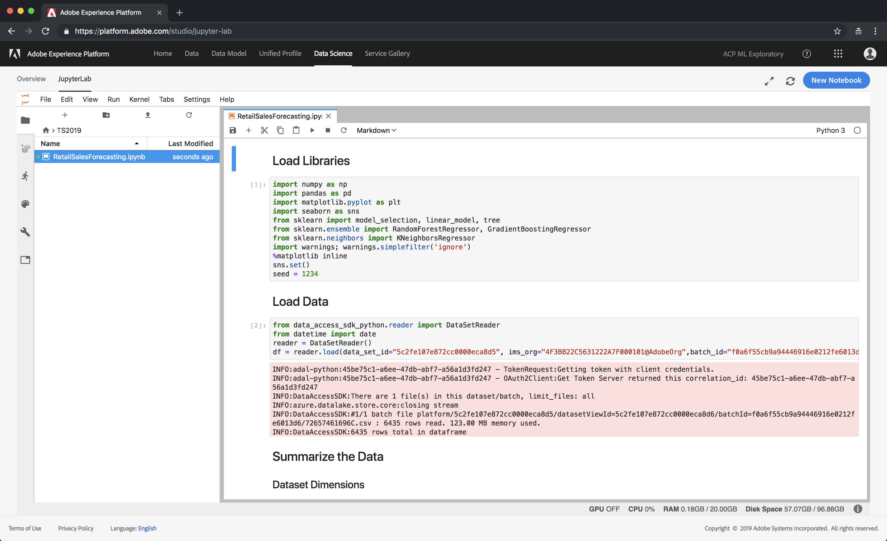
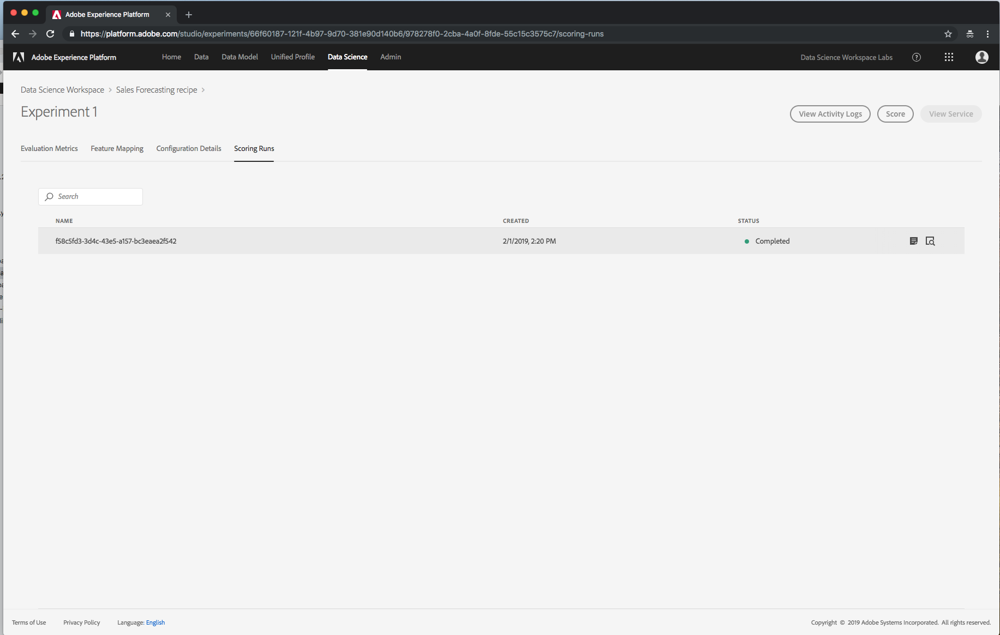

# Tech Summit 2019
Clone this repository to your laptop as we'll use files provided here for this lab session. 
Command: git clone git@git.corp.adobe.com:ml/ts-2019.git

## Usecase
**Product Purchase Prediction using Regression**
In this example we are exploring dataset containing sales transactions for products and we want to forecast sales based on the historic data that we have.
## Login & Navigate
1. Navigate to [Adobe Platform](https://platform.adobe.com).
   
2. Login with the username and password provided at your desk.
   
3. Click on **Data** tab to see the data that we have already uploaded for this lab.
   
4. Click on **Data Science** tab to open **Data Science Workspace**
   
## Create a Notebook
1. Click on Jupyterlab tab and it'll create a Jupyterlab env dedicated to your user.
   
2. Click on Upload icon and upload **RetailSalesForecasting.ipynb** notebook provided in git repo.
3. Double click on this notebook to open it in Jupyterlab.
   
4. Walkthrough the notebook, the notebook has documentaion in markdown format to describe what we are doing at every step.
5. Click on **Run > Run All Cells** to execute all the cells in this notebook.
   
## Create a Recipe
1. Click on **New** button on top right of **Overview** tab.
   
2. Fill **Create Recipe** form using values mentioned in screenshot
   **Source File** _acrzx2y854x70dvxbk0n0gwsq3xymrvje6.azurecr.io/ml-retailsales-python:0.0.1_
   **Configuration File** Upload file from **ts-2019/recipes/python/retail/retail.config.json** and click Save.
    
3. This will bring you to the Instance page. Click on **Create Instance** button on top right corner of this page. 
    
4. Fill the **Create Instance** form with the name for the instance and click Save. 
   
5. This will lead to the Experiments page. Click on **Create Experiment** on top right corner of this page. 
   
6. Fill in the details for the **Training Experiment Run** selecting the appropriate training data set (**DSWRetailsSales - Training**) and the features will be auto filtered according to the retail.config.json file. Click Run once the details are filled in.  
   
7. The training experiment run will take anywhere between 5 and 10 minutes to complete. The status will indicate **Completed**once the run is successful. 
   
8. Click on the Experiment run name to bring the insights for the training experiment that successfully completed. To initiate scoring, click on the **Score** button on the right top corner of the page. 
   
9. Fill in the details for the Scoring Experiment Run with the right dataset and click Run. 
   
10. The scoring experiment run will take between 5 and 8 minutes and the successful run will look like below.
   
11. Once the scoring run is completed successfully, the output is written to a dataset which can be previewed from the Data tab. 
   
